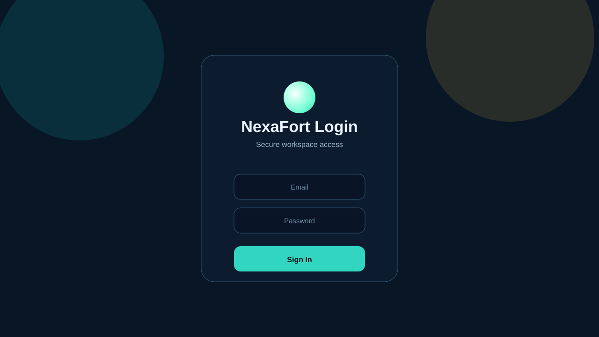
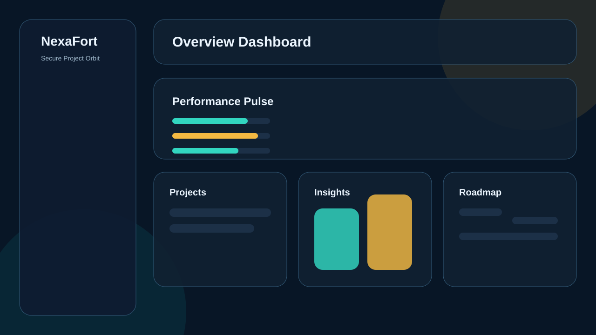

# NexaFort

Secure multi-role project workspace system built with Java 21, Spring Boot 3, PostgreSQL, Redis, React, and Docker.

## Overview

NexaFort is designed like a small enterprise backend product instead of a basic CRUD assignment. It includes JWT authentication with refresh tokens, role-based access control, caching, request tracing, admin operations, Dockerized infrastructure, and a premium frontend dashboard.

## Architecture

```text
React + Vite + Tailwind
        |
        v
Spring Boot REST API
   |            |
   v            v
PostgreSQL    Redis
```

## Core Features

### Backend

- JWT authentication with refresh tokens
- Stateless Spring Security configuration
- Role-based access control for `ROLE_USER` and `ROLE_ADMIN`
- Project CRUD with pagination, sorting, status filtering, and priority filtering
- Admin APIs to view users, update roles, delete users, and inspect all projects
- Redis caching with cache eviction on writes
- Request correlation ID logging and audit logging
- Rate limiting on authentication endpoints using Bucket4j
- DTO-based API design with validation and global exception handling
- Swagger/OpenAPI documentation with bearer auth support
- Explicit input sanitization through [InputSanitizer.java](./backend/src/main/java/com/nexafort/util/InputSanitizer.java)

### Frontend

- Protected routes with JWT persistence and token refresh
- Login and register pages
- Overview, Projects, Insights, Roadmap, and Settings pages
- Responsive glassmorphism-inspired UI
- Dark and light theme support
- Framer Motion page transitions
- Recharts analytics dashboards
- Route-based code splitting for better production loading

## Project Structure

```text
nexafort-complete/
├── backend/
│   ├── src/main/java/com/nexafort/
│   │   ├── audit/
│   │   ├── cache/
│   │   ├── config/
│   │   ├── controller/
│   │   ├── dto/
│   │   ├── entity/
│   │   ├── exception/
│   │   ├── logging/
│   │   ├── mapper/
│   │   ├── repository/
│   │   ├── security/
│   │   ├── service/
│   │   └── util/
│   └── Dockerfile
├── frontend/
├── postman/
├── docs/
│   └── screenshots/
├── docker-compose.yml
└── render.yaml
```

## Screenshots

These preview assets are included in the repo:

- Login preview: 
- Dashboard preview: 

## API Endpoints

### Authentication

- `POST /api/v1/auth/register`
- `POST /api/v1/auth/login`
- `POST /api/v1/auth/refresh`

### Projects

- `POST /api/v1/projects`
- `GET /api/v1/projects?page=0&size=10&status=ACTIVE&priority=HIGH`
- `GET /api/v1/projects/{id}`
- `PUT /api/v1/projects/{id}`
- `DELETE /api/v1/projects/{id}`

### Admin

- `GET /api/v1/admin/users`
- `PUT /api/v1/admin/users/{id}/role`
- `DELETE /api/v1/admin/users/{id}`
- `GET /api/v1/admin/projects`

## Security Notes

- Passwords are hashed with `BCryptPasswordEncoder`
- JWT access tokens are short-lived and refresh tokens are persisted
- Auth routes are rate-limited to reduce brute force traffic
- CORS is restricted through environment configuration
- Input values such as names, titles, and descriptions are sanitized before persistence
- Spring Data JPA and parameterized queries reduce SQL injection risk

## Scalability Notes

- Stateless JWT authentication supports horizontal scaling
- Redis caching reduces repeated reads on project endpoints
- Audit logging runs asynchronously
- Package boundaries keep the backend ready for future module extraction

## Local Development

### Prerequisites

- Java 21
- Maven
- Node.js 20+
- Docker Desktop

### Run with Docker

```bash
cp .env.example .env
docker-compose up --build
```

Services:

- Backend: `http://localhost:8080`
- Swagger UI: `http://localhost:8080/swagger-ui.html`
- Frontend: `http://localhost:5173`

### Run Locally

Backend:

```bash
cd backend
mvn "-Dmaven.repo.local=.m2" spring-boot:run
```

Frontend:

```bash
cd frontend
npm install
npm run dev
```

## Deployment

This repository includes deployment configuration for both backend and frontend:

- Render backend config: [render.yaml](./render.yaml)
- Vercel frontend config: [vercel.json](./frontend/vercel.json)

Suggested live URL format after deployment:

- Backend: `https://<your-render-service>.onrender.com`
- Frontend: `https://<your-vercel-project>.vercel.app`

Replace those placeholders with your actual deployed URLs after publishing.

## Postman

A ready-to-import Postman collection is included here:

- [postman/NexaFort.postman_collection.json](./postman/NexaFort.postman_collection.json)

## Environment Variables

```env
DB_HOST=localhost
DB_PORT=5432
DB_NAME=nexafort
DB_USERNAME=postgres
DB_PASSWORD=postgres

REDIS_HOST=localhost
REDIS_PORT=6379
REDIS_PASSWORD=

JWT_SECRET=change-this-secret
ALLOWED_ORIGINS=http://localhost:5173
```

## Final Notes

NexaFort now covers the core enterprise signals expected from the original phase plan: modular backend structure, production-style auth, RBAC, admin management, caching, documentation, frontend polish, Docker setup, deployment configs, and supporting portfolio assets.
