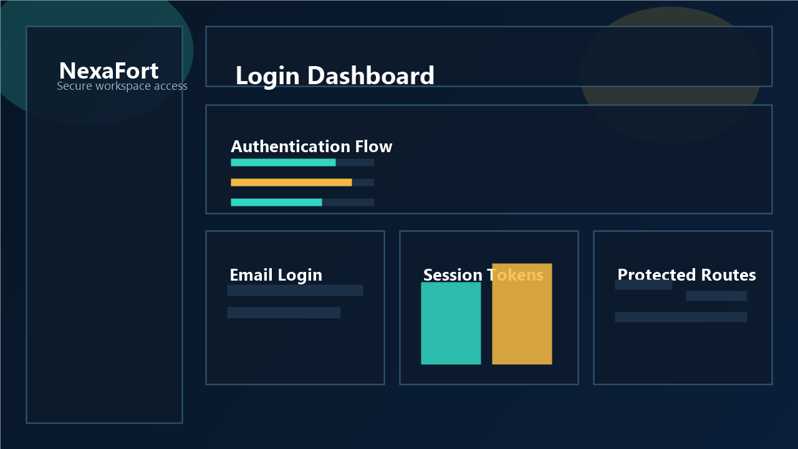
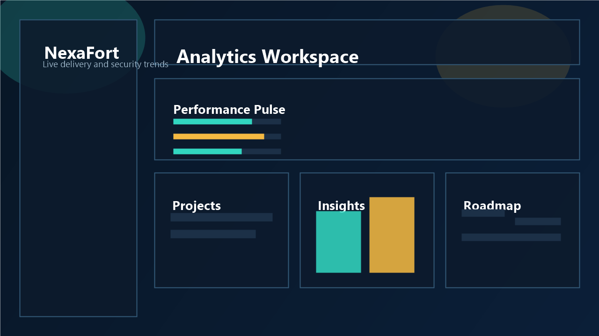
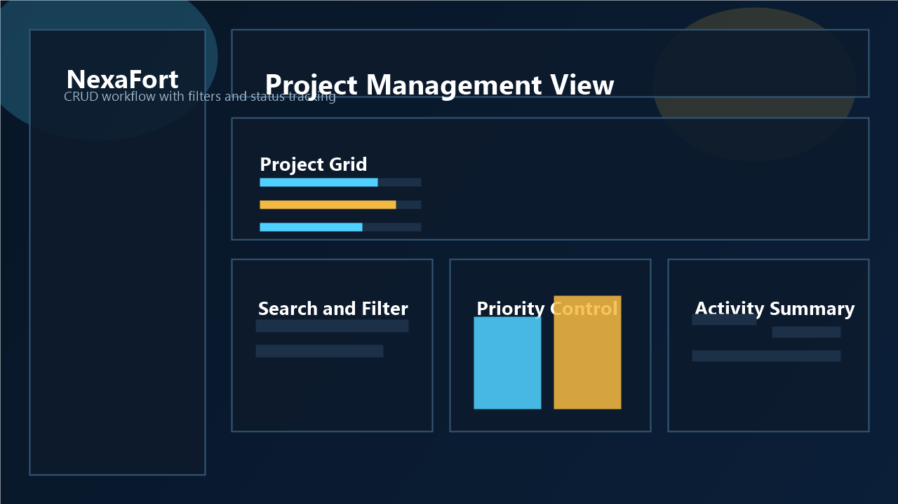
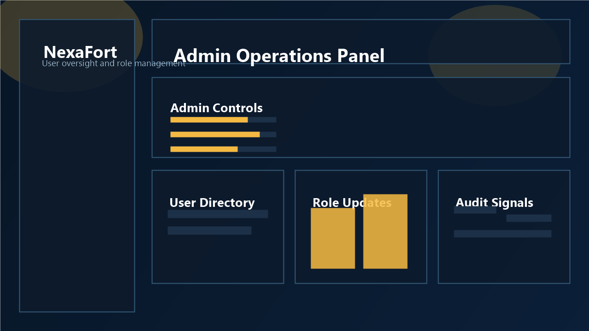

<div align="center">

# 🛡️ NexaFort

### Secure Multi-Role Project Workspace System

### Java 21 • Spring Boot 3 • PostgreSQL • Redis • React • Docker

<br>


<br><br>

> Full-stack workspace management system focused on secure API design, scalable backend architecture, and production-style engineering patterns.

</div>

---

# 🧠 Overview

NexaFort is a full-stack project workspace platform designed using modern backend engineering principles instead of basic CRUD-only architecture.

The system includes:

- JWT authentication with refresh tokens
- Role-based access control
- Redis caching
- Request tracing and audit logging
- Dockerized infrastructure
- Modern React frontend integration

The project focuses on building a modular and maintainable architecture that reflects real-world backend development practices.

---

# 🏗️ System Architecture

```text
React + Vite + Tailwind Frontend
                ↓
Spring Boot REST API
        ↓                ↓
PostgreSQL          Redis Cache
        ↓
Security + Audit Logging Layer
````

---

# ✨ Core Features

## Backend

* JWT authentication with refresh tokens
* Stateless Spring Security configuration
* Role-based access control (`ROLE_USER`, `ROLE_ADMIN`)
* Project CRUD operations
* Pagination, sorting, and filtering
* Redis caching with cache eviction
* Request correlation ID logging
* Audit logging
* Rate limiting using Bucket4j
* DTO validation and global exception handling
* Swagger/OpenAPI documentation
* Input sanitization through `InputSanitizer.java`

---

## Frontend

* Protected routes with token persistence
* Login and registration pages
* Dashboard and analytics views
* Dark/light theme support
* Framer Motion transitions
* Responsive UI using Tailwind CSS
* Route-based code splitting
* Recharts analytics dashboard

---

# 🛠️ Tech Stack

| Layer            | Technology            |
| ---------------- | --------------------- |
| Backend          | Java 21               |
| Framework        | Spring Boot 3         |
| Database         | PostgreSQL            |
| Cache            | Redis                 |
| Frontend         | React + Vite          |
| Styling          | Tailwind CSS          |
| Security         | Spring Security + JWT |
| Documentation    | Swagger/OpenAPI       |
| Containerization | Docker                |

---

# 📂 Project Structure

```text
nexafort-complete/
├── backend/
│   ├── src/main/java/com/nexafort/
│   │   ├── audit/
│   │   ├── cache/
│   │   ├── config/
│   │   ├── controller/
│   │   ├── dto/
│   │   ├── entity/
│   │   ├── exception/
│   │   ├── logging/
│   │   ├── mapper/
│   │   ├── repository/
│   │   ├── security/
│   │   ├── service/
│   │   └── util/
│   └── Dockerfile
│
├── frontend/
├── postman/
├── docs/
│   └── screenshots/
├── docker-compose.yml
└── render.yaml
```

---

# 📸 Screenshots

<div align="center">

## 🔐 Login Dashboard



---

## 📊 Analytics Workspace



---

## 📁 Project Management View



---

## 👑 Admin Operations Panel



</div>

---

# 📡 API Overview

## Authentication APIs

```http
POST /api/v1/auth/register
POST /api/v1/auth/login
POST /api/v1/auth/refresh
```

---

## Project APIs

```http
POST   /api/v1/projects
GET    /api/v1/projects
GET    /api/v1/projects/{id}
PUT    /api/v1/projects/{id}
DELETE /api/v1/projects/{id}
```

Supports:

* Pagination
* Sorting
* Filtering

---

## Admin APIs

```http
GET    /api/v1/admin/users
PUT    /api/v1/admin/users/{id}/role
DELETE /api/v1/admin/users/{id}
GET    /api/v1/admin/projects
```

---

# 🔒 Security

* BCrypt password hashing
* JWT access + refresh token lifecycle
* Bucket4j rate limiting
* DTO validation and input sanitization
* Parameterized JPA queries
* Configurable CORS policies

---

# ⚡ Scalability Notes

* Stateless JWT authentication supports horizontal scaling
* Redis reduces repeated database reads
* Async audit logging improves throughput
* Modular package boundaries support future service extraction

---

# ⚠️ Current Limitations

While NexaFort demonstrates strong backend architecture fundamentals, several limitations still exist:

* Current deployment is monolithic
* No real-time collaboration layer
* No distributed event streaming
* Limited observability beyond request tracing
* No Kubernetes orchestration

These areas provide future opportunities for exploring:

* Event-driven systems
* Real-time synchronization
* Distributed architectures
* Cloud-native infrastructure

---

# 🚀 Future Roadmap

## Real-Time Collaboration

* WebSocket synchronization
* Live workspace updates
* Multi-user editing

---

## Infrastructure Expansion

* Kubernetes deployment
* Horizontal autoscaling
* Container orchestration

---

## Event-Driven Systems

* Kafka integration
* Distributed messaging
* Async processing pipelines

---

## Advanced Observability

* OpenTelemetry integration
* Metrics dashboards
* Distributed tracing

---

## AI-Assisted Features

* AI-generated project summaries
* Workflow insights
* Productivity recommendations

---

# 🚀 Local Development

## Prerequisites

* Java 21
* Maven
* Node.js 20+
* Docker Desktop

---

# 🐳 Run with Docker

```bash
cp .env.example .env
docker-compose up --build
```

---

## Services

| Service    | URL                                                                            |
| ---------- | ------------------------------------------------------------------------------ |
| Backend    | [http://localhost:8080](http://localhost:8080)                                 |
| Swagger UI | [http://localhost:8080/swagger-ui.html](http://localhost:8080/swagger-ui.html) |
| Frontend   | [http://localhost:5173](http://localhost:5173)                                 |

---

# 💻 Run Locally

## Backend

```bash
cd backend
mvn "-Dmaven.repo.local=.m2" spring-boot:run
```

---

## Frontend

```bash
cd frontend
npm install
npm run dev
```

---

# 🚀 Deployment

Deployment configuration included for:

* Render
* Vercel

Files:

```text
render.yaml
frontend/vercel.json
```

Suggested deployed URLs:

```text
Backend  → https://nexafort-backend.onrender.com
Frontend → https://nexa-fort.vercel.app
```

---

# 📮 Postman Collection

```text
postman/NexaFort.postman_collection.json
```

---

# 🌟 Engineering Focus

NexaFort focuses on:

* Secure backend architecture
* Modular API design
* Authentication and authorization systems
* Scalable infrastructure patterns
* Modern frontend integration
* Production-oriented development practices

---

# 👨‍💻 Developer

## Ashish Patel

Interested in building:

* Backend Systems
* AI Infrastructure
* Distributed Applications
* Scalable Full-Stack Platforms

---

<div align="center">

# 🌟 Final Note

NexaFort is a backend-focused workspace management platform built to explore secure API design, modular architecture, and scalable engineering practices using modern Java infrastructure.

</div>

